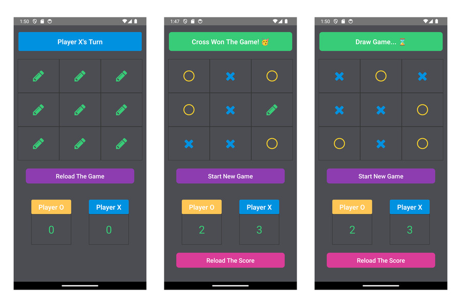

# Tic Tac Toe App

The Tic Tac Toe App is a classic and engaging game for all ages. Enjoy the timeless strategy of Tic Tac Toe on your mobile device, where you can challenge friends or the computer to a match. With a sleek, user-friendly interface and customizable game settings, you can easily switch between Xs and Os, choose your difficulty level, and track your progress. Perfect for quick games on the go or prolonged battles of wits, the Tic Tac Toe App offers endless fun and a great way to improve your strategic thinking. Start playing now!

The Tic Tac Toe app is built with React Native CLI and Typescript.

### Additional packages used in the app:
1) React Native Vector Icons (react-native-vector-icons);
2) React Native Snackbar (react-native-snackbar);

